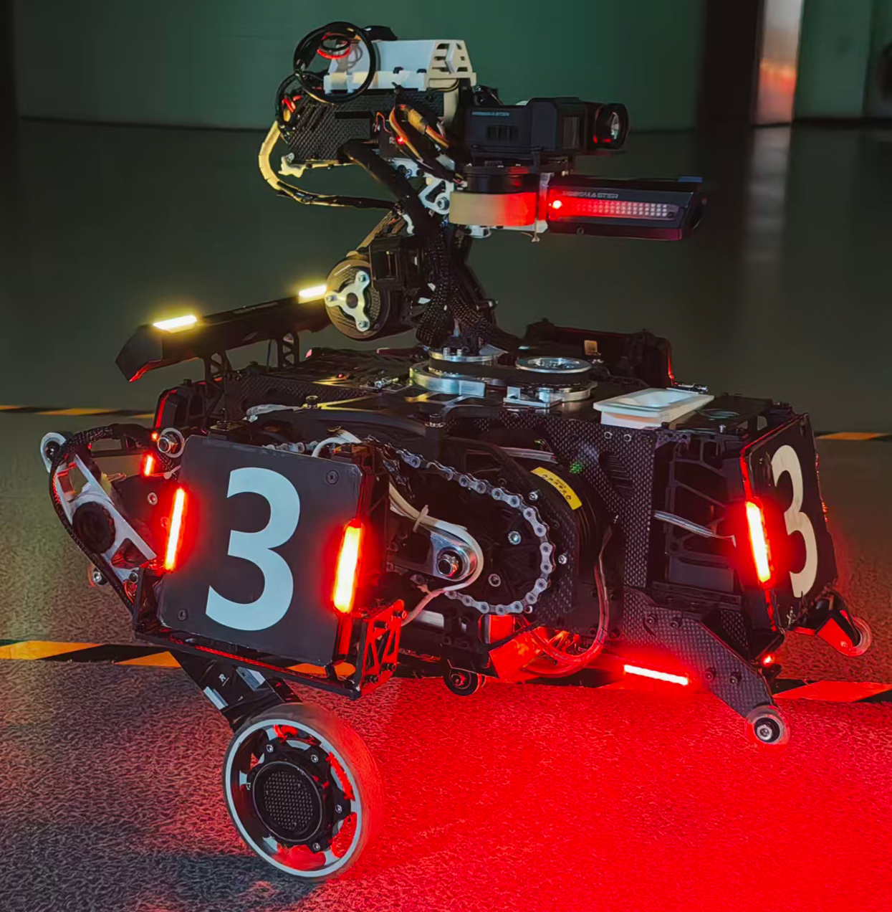
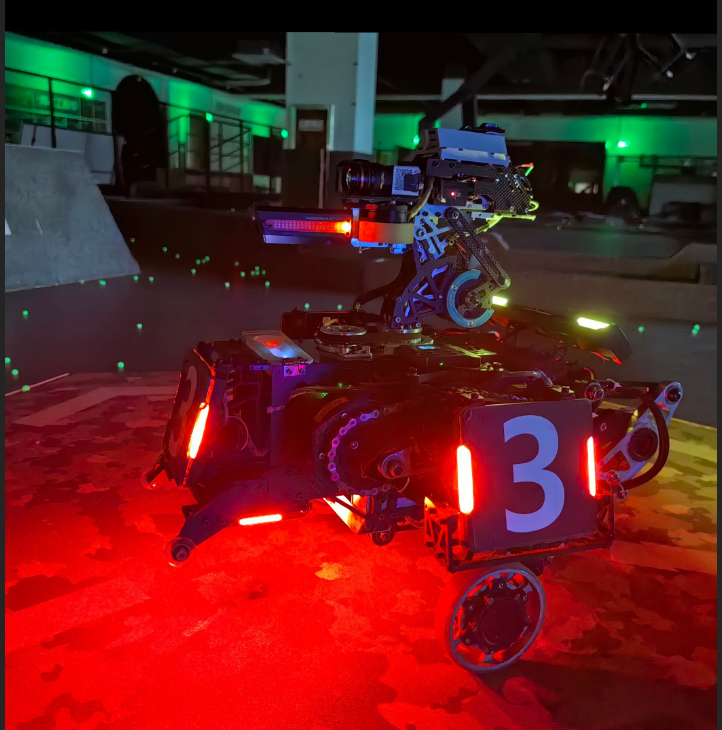
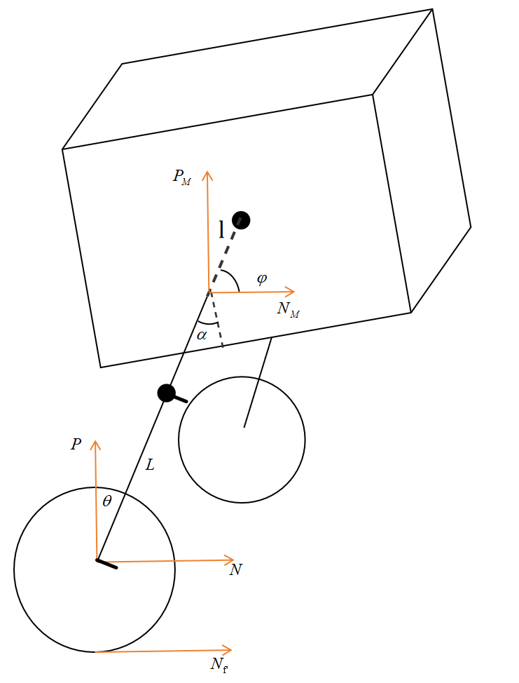

# 2026Climber Wheel-Legged Robot

常州大学Climber战队2026串联腿步兵控制算法开源项目

## 团队成员

- 机械设计: cxp
- 电控设计: zyh

## 机器人概览

  
  

## 技术架构

### 硬件配置
- **射击系统**: 2个3508电机 + 1个2006电机
- **云台系统**: 2个6020电机
- **底盘关节**: 4个达妙8009P电机
- **轮毂驱动**: 3508电机

### 控制算法
#### 云台控制
- Yaw轴: SMC滑膜控制（预留串级PID接口）
- Pitch轴: 串级PID控制

#### 底盘控制
- 运动学模型: 五连杆建模
- 控制算法: LQR控制器
- 单腿模型: 包含气弹簧处理（基于虚功原理）

## 功能特点

- 轮腿复合式移动机构
- 高精度云台控制系统
- 自适应地形能力

## 视频展示

  <video width="80%" controls>
    <source src="./测试视频/串联腿跳跃200mm台阶.mp4" type="video/mp4">
    您的浏览器不支持视频播放。
  </video>

## 使用说明

### 系统建模

### 日志
? 1/21：增加气弹簧采用虚功原理分解到竖直方向。
? 2/21：增加了FreeMaster调试配置：
  参考网站 https://sourcelizi.github.io/202011/using-freemaster/
? 2/25：增加了底盘跟随云台限幅问题，由于底盘与云台误差过大超调问题解决。
## 项目结构
- `climber_wheel_legged_robot_chassis`: 底盘控制相关代码
- `climber_wheel_legged_robot_gimbal`: 云台控制相关代码
- `图片`: 存放项目相关图片
- `测试视频`: 存放机器人功能演示视频